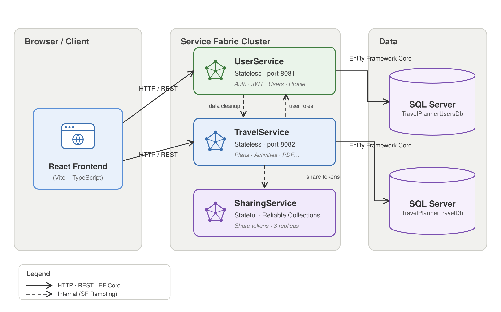
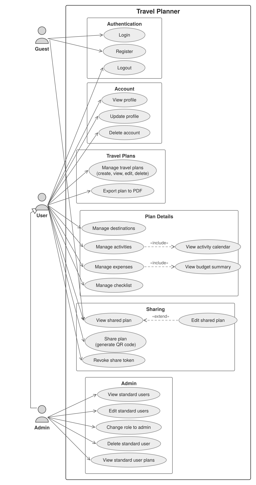

# Travel Planner

Travel Planner is a full-stack web application for planning and organizing trips. It allows users to create travel plans, manage destinations, schedule activities, track expenses, monitor budgets, maintain checklists, share plans through QR codes, and export fully formatted PDF reports.

The project was developed for the university course **Primena veb programiranja u infrastrukturnim sistemima**.

---

## Table of Contents

* [Overview](#overview)
* [Features](#features)
* [Architecture](#architecture)
* [Technology Stack](#technology-stack)
* [Prerequisites](#prerequisites)
* [Local Setup](#local-setup)
* [Environment Variables and Backend Configuration](#environment-variables-and-backend-configuration)
* [Default Credentials](#default-credentials)
* [Service Endpoints](#service-endpoints)
* [Project Structure](#project-structure)
* [Backend Structure](#backend-structure)
* [Frontend Structure](#frontend-structure)
* [Business Rules](#business-rules)
* [Documentation](#documentation)
* [Useful Commands](#useful-commands)
* [Verification Checklist](#verification-checklist)

---

## Overview

The application is organized around a travel plan as the central entity. A user can create a plan, define trip dates and budget, add destinations, schedule activities, register expenses, manage a checklist, share the plan with other people, and export the plan as a formatted PDF document.

The backend is implemented as a Microsoft Service Fabric microservice system. The frontend is implemented as a React single-page application.

---

## Features

| Area               | Description                                                                |
| ------------------ | -------------------------------------------------------------------------- |
| Authentication     | User registration and login with hashed passwords and JWT authorization.   |
| User Profile       | Users can view, update, and delete their own profile.                      |
| Travel Plans       | Create, view, update, and delete travel plans.                             |
| Destinations       | Manage multiple destinations within a travel plan.                         |
| Activities         | Schedule activities with date, time, location, status, and estimated cost. |
| Calendar View      | Display activities in a calendar view.                                     |
| Expenses           | Track expenses by category and date.                                       |
| Budget Summary     | Calculate total spending, category breakdown, and remaining budget.        |
| Checklist          | Maintain a packing or preparation checklist.                               |
| Sharing            | Generate VIEW or EDIT share links and QR codes.                            |
| Shared Plan Access | Guests can view or edit shared plans depending on token access level.      |
| PDF Export         | Export a fully formatted PDF report for a travel plan.                     |
| Admin Panel        | Admins can manage standard users and inspect their travel plans.           |

---

## Architecture

The backend consists of three Service Fabric services:

| Service        | Type      | Port     | Responsibility                                                                                                                 |
| -------------- | --------- | -------- | ------------------------------------------------------------------------------------------------------------------------------ |
| UserService    | Stateless | 8081     | Authentication, JWT issuing, roles, profiles, and user administration.                                                         |
| TravelService  | Stateless | 8082     | Travel plans, destinations, activities, expenses, budget summary, checklist, sharing endpoints, QR generation, and PDF export. |
| SharingService | Stateful  | Internal | Share token creation, validation, revocation, and storage using `IReliableDictionary`.                                         |

The application uses two SQL Server containers:

| Database                | Container                  | Host Port | Used By       |
| ----------------------- | -------------------------- | --------- | ------------- |
| `TravelPlannerUsersDb`  | `travelplanner-sql-users`  | 1433      | UserService   |
| `TravelPlannerTravelDb` | `travelplanner-sql-travel` | 1434      | TravelService |

SharingService does not use SQL Server. It stores share tokens inside a Service Fabric reliable dictionary.



---

## Technology Stack

### Backend

* .NET 6
* ASP.NET Core Web API
* Microsoft Service Fabric
* Service Fabric Remoting
* Entity Framework Core
* SQL Server
* JWT Bearer Authentication
* BCrypt password hashing
* QRCoder
* iText7

### Frontend

* React
* TypeScript
* Vite
* Tailwind CSS
* React Router
* Axios
* Context API
* React Big Calendar

### Infrastructure

* Docker
* Docker Compose
* Service Fabric Linux onebox
* SQL Server 2022 containers

---

## Prerequisites

Install the following tools before running the project.

### Required for all platforms

* .NET SDK 6.0.425
* Node.js 18+
* npm
* SQL Server runtime through Docker or a local SQL Server installation
* Service Fabric tooling appropriate for the selected platform

### macOS / Docker-based setup

The documented cross-platform setup uses Docker and the Service Fabric Linux onebox container.

Required tools:

* Docker Desktop
* Python 3
* Bash shell
* Service Fabric CLI (`sfctl`)

On Apple Silicon Macs, the Service Fabric and SQL Server images run as `linux/amd64` through Docker emulation.

### Windows setup

On Windows, the backend can be run through the standard Microsoft Service Fabric development setup:

* Visual Studio 2019, 2022 or 2026
* Azure Development workload
* Microsoft Service Fabric SDK
* Microsoft Service Fabric Runtime
* Local Service Fabric cluster
* Service Fabric CLI (`sfctl`), if CLI-based deployment or verification is used

The Docker-based setup can also be used on Windows through Docker Desktop with the WSL2 backend.

---

## Local Setup

The commands below describe the Docker-based setup. This workflow is used for running the Service Fabric Linux onebox container together with two SQL Server containers.

### 1. Open the project directory

Open a terminal in the project root directory:

```bash
cd travel-planner
```

---

### 2. Configure backend environment

```bash
cd server
cp .env.example .env
```

On Windows PowerShell:

```powershell
copy .env.example .env
```

Set the SQL Server password in `server/.env`:

```env
MSSQL_SA_PASSWORD=TravelPlannerPugs_2026!
```

The password must match the local development connection strings used by UserService and TravelService.

---

### 3. Start infrastructure

From the `server/` directory:

```bash
docker compose up -d
```

This starts:

* Service Fabric onebox cluster
* SQL Server for UserService
* SQL Server for TravelService

Service Fabric Explorer:

```txt
http://localhost:19080
```

---

### 4. Install Service Fabric CLI

From `server/`:

```bash
python3 -m venv .venv-sf
source .venv-sf/bin/activate
pip install sfctl
```

On Windows PowerShell:

```powershell
.venv-sf\Scripts\Activate.ps1
pip install sfctl
```

---

### 5. Restore .NET tools

```bash
dotnet tool restore
```

---

### 6. Apply database migrations

UserService database:

```bash
cd UserService
dotnet ef database update
cd ..
```

TravelService database:

```bash
cd TravelService
dotnet ef database update
cd ..
```

This creates:

* `TravelPlannerUsersDb`
* `TravelPlannerTravelDb`

---

### 7. Deploy backend services

From `server/`:

```bash
./deploy.sh
```

The deployment script publishes and deploys:

* UserService
* TravelService
* SharingService

Verify deployment:

```bash
sfctl application list
sfctl service list --application-id TravelPlannerApp
sfctl application health --application-id TravelPlannerApp
```

Backend Swagger pages:

```txt
http://localhost:8081/swagger
http://localhost:8082/swagger
```

> Note for Docker-based setup: `deploy.sh` is written for the Service Fabric Linux onebox workflow.
>
> Note for Windows: the backend can also be run through the standard Visual Studio + Service Fabric SDK/Runtime workflow using a local Service Fabric cluster. If the provided `deploy.sh` is used from Git Bash or WSL, the script may require replacing the macOS/BSD `sed -i ''` command with the GNU-compatible `sed -i` form.

---

### 8. Configure frontend environment

Open a new terminal:

```bash
cd client
cp .env.example .env
```

On Windows PowerShell:

```powershell
copy .env.example .env
```

Expected values:

```env
VITE_USER_SERVICE_URL=http://localhost:8081
VITE_TRAVEL_SERVICE_URL=http://localhost:8082
VITE_FRONTEND_URL=http://localhost:5173
```

---

### 9. Start frontend

```bash
npm install
npm run dev
```

Frontend URL:

```txt
http://localhost:5173
```

---

### Windows Visual Studio option

On Windows, the backend can alternatively be run with the standard Service Fabric development workflow:

1. Start the local Service Fabric cluster.
2. Open `server/TravelPlanner.sln` in Visual Studio.
3. Ensure the Service Fabric SDK and Runtime are installed.
4. Configure SQL Server connection strings for the selected SQL Server setup.
5. Apply Entity Framework migrations for UserService and TravelService.
6. Deploy the Service Fabric application from Visual Studio.

The React frontend is still started from the `client/` directory with:

```bash
npm install
npm run dev
```

---

## Environment Variables and Backend Configuration

### Backend environment file

File:

```txt
server/.env
```

Example:

```env
MSSQL_SA_PASSWORD=TravelPlannerPugs_2026!
```

This value is used by `docker-compose.yml` when starting the SQL Server containers.

Real `.env` files should not be committed.

---

### Backend appsettings files

The backend services also require configuration through their own `appsettings.json` files.

#### UserService

File:

```txt
server/UserService/appsettings.json
```

Required configuration sections:

```json
{
  "ConnectionStrings": {
    "DefaultConnection": "Server=travelplanner-sql-users,1433;Database=TravelPlannerUsersDb;User Id=sa;Password=TravelPlannerPugs_2026!;TrustServerCertificate=True;Encrypt=False;",
    "DesignTimeConnection": "Server=localhost,1433;Database=TravelPlannerUsersDb;User Id=sa;Password=TravelPlannerPugs_2026!;TrustServerCertificate=True;Encrypt=False;"
  },
  "Cors": {
    "AllowedOrigins": [
      "http://localhost:5173",
      "http://127.0.0.1:5173"
    ]
  },
  "DefaultAdmin": {
    "Name": "System Admin",
    "Email": "admin@travelplanner.com",
    "Password": "AdminPassword123!"
  },
  "TravelService": {
    "ServiceUri": "fabric:/TravelPlannerApp/TravelService"
  },
  "Jwt": {
    "Issuer": "TravelPlannerDev",
    "Audience": "TravelPlannerUsers",
    "Key": "TravelPlannerDevKey_2026_NotForProdOnlyForDevelopmentStage!",
    "ExpiresMinutes": "60"
  }
}
```

#### TravelService

File:

```txt
server/TravelService/appsettings.json
```

Required configuration sections:

```json
{
  "ConnectionStrings": {
    "DefaultConnection": "Server=travelplanner-sql-travel,1433;Database=TravelPlannerTravelDb;User Id=sa;Password=TravelPlannerPugs_2026!;TrustServerCertificate=True;Encrypt=False;",
    "DesignTimeConnection": "Server=localhost,1434;Database=TravelPlannerTravelDb;User Id=sa;Password=TravelPlannerPugs_2026!;TrustServerCertificate=True;Encrypt=False;"
  },
  "Cors": {
    "AllowedOrigins": [
      "http://localhost:5173",
      "http://127.0.0.1:5173"
    ]
  },
  "Sharing": {
    "PublicBaseUrl": "http://localhost:5173",
    "ServiceUri": "fabric:/TravelPlannerApp/SharingService"
  },
  "UserService": {
    "ServiceUri": "fabric:/TravelPlannerApp/UserService"
  },
  "Jwt": {
    "Issuer": "TravelPlannerDev",
    "Audience": "TravelPlannerUsers",
    "Key": "TravelPlannerDevKey_2026_NotForProdOnlyForDevelopmentStage!",
    "ExpiresMinutes": "60"
  }
}
```

Connection string meaning:

| Connection             | Purpose                                                                     |
| ---------------------- | --------------------------------------------------------------------------- |
| `DefaultConnection`    | Used by the service while running inside the Service Fabric Docker network. |
| `DesignTimeConnection` | Used from the host machine when running Entity Framework migrations.        |

The Docker service names are used inside the containers:

| Service       | Runtime SQL Host                |
| ------------- | ------------------------------- |
| UserService   | `travelplanner-sql-users,1433`  |
| TravelService | `travelplanner-sql-travel,1433` |

The host ports are used for migrations from the local machine:

| Service       | Design-Time SQL Host |
| ------------- | -------------------- |
| UserService   | `localhost,1433`     |
| TravelService | `localhost,1434`     |

---

### Frontend environment file

File:

```txt
client/.env
```

Example:

```env
VITE_USER_SERVICE_URL=http://localhost:8081
VITE_TRAVEL_SERVICE_URL=http://localhost:8082
VITE_FRONTEND_URL=http://localhost:5173
```

The frontend reads backend URLs from this file through Vite environment variables.

Real `.env` files should not be committed.

---

## Default Credentials

A default admin account is seeded on first startup.

| Field    | Value                     |
| -------- | ------------------------- |
| Email    | `admin@travelplanner.com` |
| Password | `AdminPassword123!`       |
| Role     | `Admin`                   |

Regular users can be created through the registration page.

---

## Service Endpoints

| Component               | URL                             |
| ----------------------- | ------------------------------- |
| Frontend                | `http://localhost:5173`         |
| UserService API         | `http://localhost:8081`         |
| UserService Swagger     | `http://localhost:8081/swagger` |
| TravelService API       | `http://localhost:8082`         |
| TravelService Swagger   | `http://localhost:8082/swagger` |
| Service Fabric Explorer | `http://localhost:19080`        |
| SQL Server Users DB     | `localhost:1433`                |
| SQL Server Travel DB    | `localhost:1434`                |

---

## Project Structure

```txt
travel-planner/
├── server/
│   ├── TravelPlanner.sln
│   ├── TravelPlannerApp/
│   ├── UserService/
│   ├── TravelService/
│   ├── SharingService/
│   ├── TravelPlanner.Shared/
│   ├── docker-compose.yml
│   ├── deploy.sh
│   └── global.json
│
├── client/
│   ├── src/
│   │   ├── api/
│   │   ├── components/
│   │   ├── context/
│   │   ├── features/
│   │   ├── routes/
│   │   └── utils/
│   ├── package.json
│   └── vite.config.ts
│
├── docs/
│   ├── architecture.png
│   └── use-case.png
│
└── README.md
```

---

## Backend Structure

### UserService

Responsible for:

* registration;
* login;
* password hashing;
* JWT creation;
* user profile management;
* admin user management;
* role management;
* user deletion flow.

### TravelService

Responsible for:

* travel plan CRUD;
* destination CRUD;
* activity CRUD;
* expense CRUD;
* budget summary;
* checklist management;
* share link generation;
* QR code generation;
* PDF export;
* shared plan endpoints;
* ownership and authorization validation.

### SharingService

Responsible for:

* creating share tokens;
* validating share tokens;
* revoking share tokens;
* removing all share tokens for a deleted travel plan.

SharingService is implemented as a stateful Service Fabric service and stores data in an `IReliableDictionary`.

### TravelPlanner.Shared

Contains shared DTOs, enums, and Service Fabric Remoting contracts.

---

## Frontend Structure

The frontend is organized by feature.

```txt
features/<feature>/
├── api/
├── types/
├── components/
└── pages/
```

Frontend rules followed in the project:

* components are functional React components;
* shared state is handled through Context API;
* HTTP calls are isolated in API service files;
* backend URLs are read from `.env`;
* TypeScript interfaces are used for frontend models;
* forms use controlled inputs;
* reusable UI components are used where appropriate;
* backend errors are displayed to the user.

---

## Business Rules

The application enforces the following rules:

* Travel plan end date cannot be before start date.
* Travel plan budget cannot be negative.
* Travel plan cannot be created in the past.
* Destination departure date cannot be before arrival date.
* Destination dates must be inside the travel plan date range.
* Activity date must be inside the travel plan date range.
* Activity estimated cost cannot be negative.
* Expense amount cannot be negative.
* Passwords are hashed before storage.
* JWT signature and expiry are validated.
* Users can manage their own travel plans.
* Admins can inspect and manage standard users.
* VIEW share tokens allow read-only access.
* EDIT share tokens allow editing through shared endpoints.
* Every shared request validates the token through SharingService.
* Deleting a travel plan removes related destinations, activities, expenses, checklist items, and share tokens.
* Deleting a user removes that user's travel data.

---

## Documentation

### Architecture Diagram


The architecture diagram shows the main structure of the system:

* React frontend;
* UserService;
* TravelService;
* SharingService;
* Service Fabric Remoting;
* SQL Server database for users;
* SQL Server database for travel data;
* Service Fabric onebox runtime.

### Use Case Diagram



Actors:

| Actor | Description                                                              |
| ----- | ------------------------------------------------------------------------ |
| Guest | Can register, log in, and access a shared plan through a valid token.    |
| User  | Can manage their own travel plans and all related plan data.             |
| Admin | Extends User and can also manage standard users and inspect their plans. |

Main relationships:

* Admin extends User.
* User manages travel plans.
* Travel plan management includes destinations, activities, expenses, checklist, sharing, and PDF export.
* Activity management includes calendar view.
* Expense management includes budget summary.
* Edit shared plan extends view shared plan.
* Guest can view shared plans with VIEW tokens.
* Guest can edit shared plans with EDIT tokens.

---

## Useful Commands

### Start infrastructure

```bash
cd server
docker compose up -d
```

### Stop infrastructure

```bash
cd server
docker compose down
```

### Stop infrastructure and remove volumes

```bash
cd server
docker compose down -v
```

### Apply UserService migrations

```bash
cd server/UserService
dotnet ef database update
```

### Apply TravelService migrations

```bash
cd server/TravelService
dotnet ef database update
```

### Deploy backend

```bash
cd server
./deploy.sh
```

### Start frontend

```bash
cd client
npm install
npm run dev
```

### Build frontend

```bash
cd client
npm run build
```

---

## Verification Checklist

After setup, verify that:

* Docker containers are running:

  * `travelplanner-sf`
  * `travelplanner-sql-users`
  * `travelplanner-sql-travel`
* Service Fabric Explorer opens at `http://localhost:19080`.
* UserService Swagger opens at `http://localhost:8081/swagger`.
* TravelService Swagger opens at `http://localhost:8082/swagger`.
* Frontend opens at `http://localhost:5173`.
* Admin login works with the default credentials.
* A regular user can create and manage a complete travel plan.
* Activities appear in the calendar view.
* Expenses update the budget summary.
* Checklist items can be added, edited, completed, and deleted.
* Share links and QR codes are generated.
* VIEW shared links are read-only.
* EDIT shared links allow editing.
* PDF export downloads a fully formatted travel plan report.
* Admin can manage standard users and inspect their plans.

---
